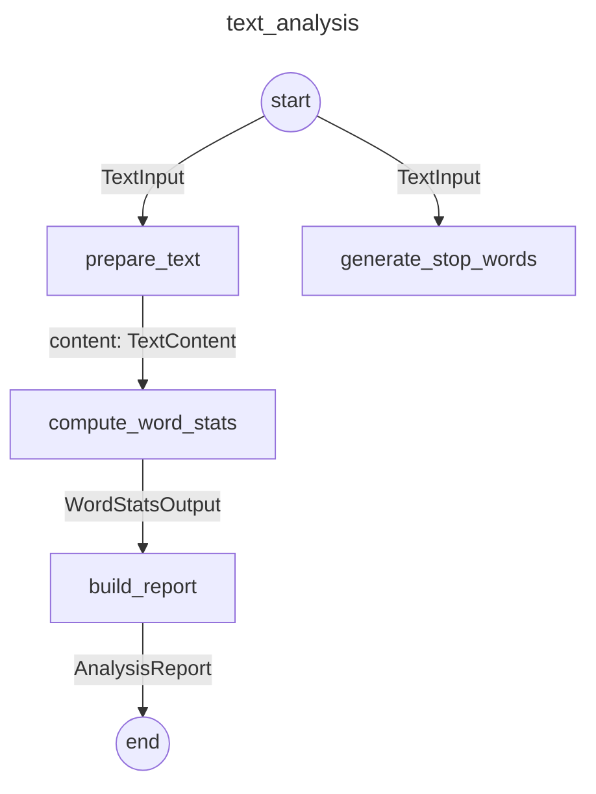

# Taskmaestro

<p align="center">
  
</p>

A Python 3.12+ library for defining and executing typed DAG task workflows with Pydantic models, lifecycle hooks, and fail-fast semantics.

## Installation

```bash
python3 -m venv .venv
source .venv/bin/activate
pip install -e ".[dev]"
```

## Quick Start

### Linear Pipeline

```python
from pydantic import BaseModel
from taskmaestro import Task, Workflow, Job, Runner, ExecutionContext

class NumberInput(BaseModel):
    value: int

class NumberOutput(BaseModel):
    value: int

class AddOne(Task[NumberInput, NumberOutput]):
    def run(self, input: NumberInput, ctx: ExecutionContext) -> NumberOutput:
        return NumberOutput(value=input.value + 1)

class Double(Task[NumberOutput, NumberOutput]):
    def run(self, input: NumberOutput, ctx: ExecutionContext) -> NumberOutput:
        return NumberOutput(value=input.value * 2)

workflow = Workflow(name="math", tasks=[AddOne, Double])
job = Job(workflow=workflow, config=NumberInput(value=5))
result = Runner().run(job)

print(result.status)        # "completed"
print(result.result.value)  # 12
```

### DAG Workflow (Fan-In)

```python
from pydantic import BaseModel
from taskmaestro import Task, Workflow, Job, Runner, ExecutionContext

class Input(BaseModel):
    value: int

class Output(BaseModel):
    value: int

class MergedInput(BaseModel):
    a: Output
    b: Output

class MergedOutput(BaseModel):
    total: int

class BranchA(Task[Input, Output]):
    def run(self, input: Input, ctx: ExecutionContext) -> Output:
        return Output(value=input.value + 1)

class BranchB(Task[Input, Output]):
    def run(self, input: Input, ctx: ExecutionContext) -> Output:
        return Output(value=input.value * 2)

class Merge(Task[MergedInput, MergedOutput]):
    def run(self, input: MergedInput, ctx: ExecutionContext) -> MergedOutput:
        return MergedOutput(total=input.a.value + input.b.value)

workflow = (
    Workflow.builder(name="fan_in")
    .add_task(BranchA)
    .add_task(BranchB)
    .add_task(Merge, depends_on={"a": BranchA, "b": BranchB})
    .build()
)

job = Job(workflow=workflow, config=Input(value=5))
result = Runner().run(job)

print(result.status)        # "completed"
print(result.result.total)  # 16 (6 + 10)
```

## Core Concepts

You define **Tasks** (typed units of work), compose them into a **Workflow** (linear chain or DAG), bind input data via a **Job**, and hand it to a **Runner** for execution. Type safety is enforced at build time — input/output models are validated across the entire graph. Fail-fast semantics stop execution on the first error, and **Hooks** provide cross-cutting lifecycle observations without coupling to task logic.

| Concept | Description |
|---|---|
| **Task** | Subclass `Task[I, O]` with Pydantic models for input and output, then implement `run(input, ctx)`. Each task can declare an optional `timeout_seconds`. For tasks with multiple named outputs, use inline `Inputs`/`Outputs` classes inside the task body. |
| **Workflow** | Build a linear pipeline with `Workflow(tasks=[...])` or a DAG with `Workflow.builder()`. The builder accepts `depends_on` for single dependencies, fan-in dicts (`{"field": UpstreamTask}`), and `(Task, "field")` tuples for output field routing. Use `config_fields` to declare which input fields come from `JobConfiguration`. Workflows are validated at build time for cycles, type compatibility, and input completeness. |
| **Job** | Binds a Workflow to a typed config (the root task's input). Tracks `status` (`pending` → `running` → `completed`/`failed`), the final `result`, any `error`, and per-task `task_results`. Optionally accepts a `JobConfiguration` for per-task static config values. A job can only be run once. |
| **Runner** | Executes tasks in topological order, stopping on the first failure (fail-fast). Supports per-task and per-job timeouts via `signal.alarm` (Unix only). Dispatches lifecycle events to registered hooks. |
| **ExecutionContext** | Passed to every `run()` call. Provides a `logger`, an auto-generated `correlation_id` (UUID), a `scratch_dir` (temporary directory), and a service registry (`register()`/`resolve()`) for injecting shared resources like DB connections. |
| **Hooks** | Subclass `BaseHook` and override methods like `on_job_start`, `on_task_complete`, etc. Hook errors are swallowed and reported via `warnings.warn()`, so they never crash the job. Built-ins: `LoggingHook`, `TimingHook`, `ResultPersistenceHook`. |
| **ObjectModel** | Generic `ObjectModel[T]` base model for wrapping arbitrary (non-Pydantic) objects. Enables `arbitrary_types_allowed` so fields can hold native library objects like database connections or API clients. |

## Named Task Instances

The same Task class can appear multiple times in a workflow with different names. Use the `name=` parameter in `add_task()`:

```python
workflow = (
    Workflow.builder(name="parallel_wells")
    .add_task(LoadModel)
    .add_task(LoadWellPath, name="well_1", depends_on=LoadModel)
    .add_task(LoadWellPath, name="well_2", depends_on=LoadModel)
    .add_task(Process, name="proc_1", depends_on="well_1")
    .add_task(Process, name="proc_2", depends_on="well_2")
    .build()
)
```

Named instances can be referenced as string dependencies (`depends_on="well_1"`) or in fan-in dicts.

## Per-Task Configuration

`JobConfiguration` provides static config values for individual tasks, merged with upstream outputs at runtime. Declare which fields come from config with `config_fields`:

```python
from taskmaestro import EmptyConfig, Job, JobConfiguration, Workflow

workflow = (
    Workflow.builder(name="configured")
    .add_task(LoadModel, config_fields=["path"])          # root: all input from config
    .add_task(Transform, depends_on=LoadModel, config_fields=["scale_factor"])  # mixed
    .build()
)

job_config = JobConfiguration({
    "load_model": {"path": "/data/model.egrid"},
    "transform": {"scale_factor": 2.5},
})

job = Job(workflow=workflow, config=EmptyConfig(), job_configuration=job_config)
result = Runner().run(job)
```

## Output Field Routing

Route a specific field from an upstream task's output (rather than the whole output) using `(Task, "field")` tuples:

```python
class ExtractKeywords(Task):
    class Inputs(BaseModel):
        content: TextContent

    class Outputs(BaseModel):
        keywords: KeywordsOutput
        num_words_removed: int

    def run(self, input: Inputs, ctx: ExecutionContext) -> Outputs: ...

workflow = (
    Workflow.builder(name="analysis")
    .add_task(ExtractKeywords, depends_on=PrepareText)
    .add_task(
        BuildReport,
        depends_on={
            "keywords": (ExtractKeywords, "keywords"),              # routes .keywords field
            "num_words_removed": (ExtractKeywords, "num_words_removed"),  # routes .num_words_removed
            "stats": ComputeWordStats,                              # whole output
        },
    )
    .build()
)
```

## ObjectModel

`ObjectModel[T]` wraps arbitrary (non-Pydantic) objects so they can flow through workflows. Use it as a type alias for simple wrappers, or subclass it to add extra fields:

```python
from taskmaestro import ObjectModel

# Type alias — no extra fields needed
GridCase = ObjectModel[rips.EclipseCase]
WellPath = ObjectModel[rips.WellPath]

# Subclass — adds fields alongside the wrapped object
class AddPerforationInput(ObjectModel[rips.WellPath]):
    start_md: float
    end_md: float

# Access the wrapped object via .value
grid = GridCase(value=eclipse_case)
print(grid.value.name)
```

## Plugin discovery

Installed packages can publish tasks and workflows using standard Python entry points:

```toml
[project.entry-points."taskmaestro.tasks"]
"acme.prepare" = "acme_tasks.prepare:Prepare"

[project.entry-points."taskmaestro.workflows"]
"acme.analysis" = "acme_tasks.workflows:analysis_workflow"
```

A task entry point must resolve to a `Task` subclass and a workflow entry point must
resolve to a `Workflow` instance. Prefix names with the provider name to avoid clashes.
Consumers can discover plugins without scanning package directories:

```python
from taskmaestro import registered_tasks, registered_workflows

tasks = registered_tasks()          # dict[str, type[Task]]
workflows = registered_workflows()  # dict[str, Workflow]
```

Use `registered_task_names()` and `registered_workflow_names()` to inspect identifiers
without importing plugin modules, or `get_registered_task(name)` and
`get_registered_workflow(name)` to load one plugin. Duplicate names and invalid plugin
types raise `PluginLoadError`.

## YAML Configuration

Workflows can be defined entirely in YAML instead of Python. A `task:` value may be
either a registered task identifier or a dotted Python class path. The loader resolves
registered identifiers first and validates the full configuration:

```yaml
# workflow.yaml
workflow:
  name: text_analysis
  tasks:
    - task: pipeline.PrepareText
    - task: pipeline.GenerateStopWords
    - task: pipeline.ComputeWordStats
      depends_on:
        content: pipeline.PrepareText
        stop_words: pipeline.GenerateStopWords
    - task: pipeline.ExtractKeywords
      depends_on:
        content: pipeline.PrepareText
        stop_words: pipeline.GenerateStopWords
    - task: pipeline.ScoreReadability
      depends_on: pipeline.PrepareText
    - task: pipeline.BuildReport
      depends_on:
        stats: pipeline.ComputeWordStats
        keywords: [pipeline.ExtractKeywords, keywords]                    # output field routing
        readability: pipeline.ScoreReadability
        num_words_removed: [pipeline.ExtractKeywords, num_words_removed]  # output field routing

runner:
  hooks:
    - hook: taskmaestro.hooks.logging.LoggingHook
    - hook: taskmaestro.hooks.timing.TimingHook

context:
  services:
    title: "Python Overview"
```

```yaml
# input.yaml
text: "Python is a high-level programming language..."
title: "Python Overview"
```

Load and run:

```python
from taskmaestro import load_workflow_from_yaml, run_workflow_from_yaml

# Load for inspection, then run
loaded = load_workflow_from_yaml("workflow.yaml", "input.yaml")
result = loaded.run()

# Or run directly
result = run_workflow_from_yaml("workflow.yaml", "input.yaml")
```

YAML supports named task instances (`name:`), per-task input config (keyed by task name in the input file), fan-in dicts, and output field routing via `[task, field]` lists.

## Visualization

Generate Mermaid diagrams of workflow topology:

```python
print(workflow.to_mermaid())
# or with config nodes:
print(workflow.to_mermaid(job_configuration=job_config))
```

Output:



Edges are labeled with data types. Fan-in edges show field names, and field routing edges show `.field: Type`. When a `JobConfiguration` is provided, configured tasks get dashed edges from a `JobConfiguration` node.

## Error Handling

```
WorkflowRunnerError (base)
├── WorkflowDefinitionError       # Invalid workflow definition
│   ├── CycleDetectedError        # Dependency cycle
│   └── IncompleteInputError      # Missing fan-in field mappings
├── JobStateError                 # e.g., re-running a completed job
├── ConfigLoadError               # YAML config loading failure
└── TaskExecutionError            # Runtime task failure
    ├── TaskOutputTypeError       # Output type mismatch
    └── TaskTimeoutError          # Task exceeded timeout
```

## Examples

Two full example pipelines are included in the `examples/` directory:

| Example | Features |
|---|---|
| `examples/text_analysis/` | DAG with fan-out/fan-in, output field routing, inline `Inputs`/`Outputs` classes, YAML config, Mermaid visualization |
| `examples/resinsight/` | `ObjectModel[T]` for gRPC objects, `JobConfiguration` with per-task config, named task instances, `config_fields`, YAML config |

Run an example:

```bash
python examples/text_analysis/pipeline.py              # Python API
python examples/text_analysis/pipeline.py --yaml       # YAML config
```

## Development

```bash
source .venv/bin/activate
pytest -v                  # run tests
ruff check .               # lint
ruff format .              # format
mypy taskmaestro       # type check (strict)
```
